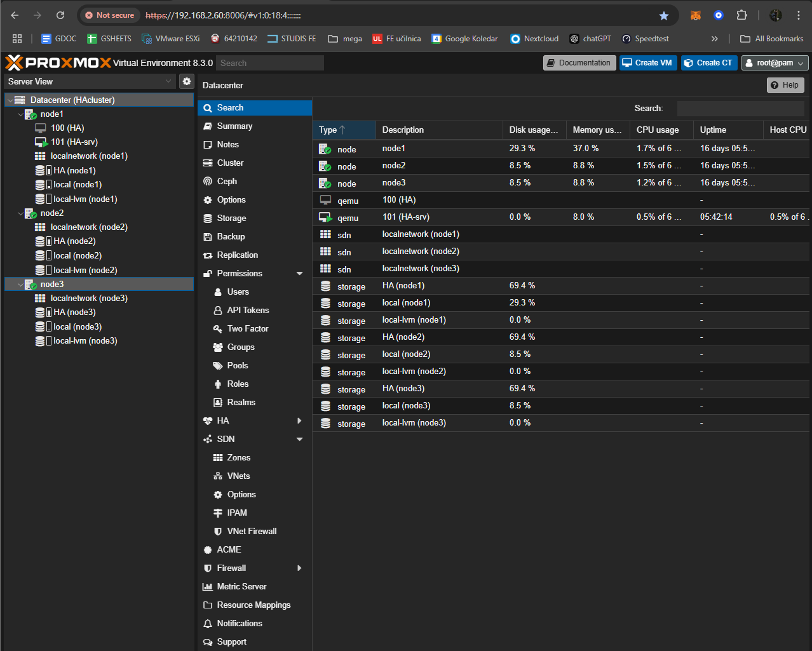

# Visokorazpoložljiva virtualizacija s ProxMox

### Kaj je visokorazpoložljiva virtualizacija?

Visokorazpoložljiva (High Availability – HA) virtualizacija je pristop v informacijskih tehnologijah, ki omogoča, da virtualizirane delovne obremenitve, aplikacije in storitve ostanejo dostopne tudi ob morebitnih okvarah strojne ali programske opreme. Gre za ključno komponento sodobnih IT-sistemov, kjer je neprekinjeno delovanje storitev poslovno kritično.

S pomočjo visokorazpoložljive virtualizacije lahko organizacije zmanjšajo ali povsem odpravijo izpade delovanja, saj sistem samodejno preusmeri delovne obremenitve z okvarjenih ali nedostopnih vozlišč (strežnikov) na tista, ki so še vedno operativna. To dosežemo z uporabo gruče (clusterja) strežnikov, ki so povezani med seboj in delujejo kot enoten sistem.

V okviru ProxMox okolja se visokorazpoložljivost doseže s kombinacijo naslednjih tehnologij in konceptov:

* **Gruče (clusters)** : Več ProxMox strežnikov, ki skupaj delujejo kot enota.
* **Deljena shramba** : Omogoča, da imajo vsa vozlišča v gruči dostop do istih podatkov, kar omogoča hitro migracijo virtualnih strojev med vozlišči.
* **Failover mehanizmi** : Samodejna migracija virtualnih strojev s pokvarjenega ali nedosegljivega strežnika na delujočega.
* **Redundantne povezave** : Zmanjšujejo tveganje odpovedi omrežja.
* **Heartbeat** : Komunikacija med vozlišči, ki spremlja njihovo stanje in omogoča pravočasen odziv na težave.

## Namen projektne naloge

Namen moje projektne naloge je vzpostavitev gruče treh ProxMox strežnikov, na katerih bo postavljen virtualka in/ali container, ki bo vključen v ProxMoxov sistem visokorazpoložljivosti (HA). S tem bomo zagotovili "neprekinjeno delovanje" sistema, tudi v primeru izpadov posameznih strežnikov.

Na tem sistemu bo deloval osnovni Linux strežnik z nameščenim Apache spletnih strežnikom, ki bo omogočal preverjanje dostopnosti do strežnika in s tem potrjevanje funkcionalnosti visokorazpoložljivosti.

Če bo tehnično izvedljivo, bom v gručo vključil tudi ProxMox strežnik, nameščen na oddaljeni lokaciji zunaj lokalnega omrežja. To bi omogočilo dodatno raven redundance in preizkus visokorazpoložljivosti v razpršenem okolju.

Naloga vključuje tudi testiranje in analizo delovanja sistema ob simuliranih izpadih ter oceno učinkovitosti ProxMoxovih HA-mehanizmov.

## Konfiguracija

### Nested virtualizacija proxmoxa znotraj VMware ESXi

Za pravilno delovanje gruče, natančneje proxmoxove HA, moramo v cluster dodati minimalno 3 strežnike. To je potrebno zaradi mehanizma odločanja, poznanega tudi kot Quorum.

Quorum v kontekstu porazdeljenih sistemov, kot je Proxmox gruča, je mehanizem, ki se uporablja za zagotavljanje doslednega sprejemanja odločitev in preprečevanje poškodb podatkov ali pojavov, kot je "split-brain". To se doseže tako, da mora večina vozlišč (ali udeležencev) v gruči soglašati, preden se izvedejo določene operacije, kot so upravljanje virov ali določanje aktivnih vozlišč.

Za odločanje lahko uporabljamo tudi zunanji quorum server, ki se uporablja kot tie-breaker. Ker proxmox HA deluje brez zunanjega serverja, moramo zagotoviti, da pri odločanju o prevzemu bremena ne pride do izenačenja v glasovanju. Če bi za vpostavitev clustra uporabili samo 2 noda bi vedno prišlo do izenačitve, saj bi vedno glasovala en drugega.

Do odločitve o uporabi nested virtualizacije proxmoxa znotraj ESXi je prišlo, ker imam doma omejene hardwarske komponente in ne morem namestiti 3 fizičnih serverjev z proxmox hypervisorji.

### Deployment proxmox virtualk

1. Naložiti moramo ISO image proxmoxovega OS-a, in sicer sam sem uporabil [Proxmox VE ver 8.3-1](https://enterprise.proxmox.com/iso/proxmox-ve_8.3-1.iso "proxmox VE 8.3-1").
2. ISO image moramo prenesti na disk, dodeljen ESXi hypervisorju.

   
3. Nato lahko nadaljujemo z izdelavo nove virtualke

   
4. izberemo opcijo izdelave nove virtualke, vpišemo ime in izberemo operacijski sistem (other, 64bit), izberemo na katerem datastoru bodo shranjeni podatki iz naše virtualne instance, na koncu še dodelimo vire in s tem smo postopek izdelave zaključili.

   
5. ta postopek moramo ponoviti še 2x za preostala 2 noda, ki jih bomo kasneje dodajali v proxmox cluster.

Specifikacije ki sem jih dodelil so razvidne is slike spodaj. Ker gre za nested virtualizacijo, s katero se prej nisem ukvarjal, sem raje dodelil več virov. Prav tako je pomembno omeniti, da je nujno potrebno dodati 2 ločena virtualna diska, saj potrebujemo enega za sam OS, drugega pa za izdelavo ZFS poolov, kateri se bodo kasneje uporabljali pri HA.

### Združevanje treh proxmox strežnikov v cluster

Proxmox ima zelo dobro podporo gručenja večih nodov, na spletnem UI lahko dostopamo do centraliziranega upravljanja (upravljamo lahko vse VM-je iz katerega koli noda v gruči), ima skupno konfiguracijo (proxmox uporablja Corosync, komunikacijski protokol za izmenjavo podatkov in statusov med vozlišči), imamo možnost HA, lahko delamo live migrations, imamo možnost skupnega shranjevanja podatkov in zelo enostavno lahko nova vozlišča dodajamo v obstoječo gručo

Vpogled v spletni vmesnik, za nadzorovanje gruče:

Postopek za vzpostavitev gruče je nasleden:

1. Na enemu od nodov, na spletnem vmesniku pod zavihkom Datacenter > Cluster stisnemo gumb create cluster, kjer nato vpišemo ime in izberemo network interface, katerega bo server koristil za sinhronizacijo.

   
2. Na preostalih dveh proxmox strežnikih se tej gruči pridružimo tako, da pod zavihkom Datacenter > Cluster stisnemo gumb Join Cluster, odpre se zavihek, ki nas povpraša o "Join information".

   
3. Na prvem strežniku moramo za pridobitev teh informacij odpreti zavihek Datacenter > Cluster stisnemo gumb Join information, kjer se odpre novo okno s potrebnimi informacijami. Stisnemo gumb Copy Information

   
4. Na strežnikih, katere probamo dodati v gručo nato prilepimo information v Cluster Join okno, kjer moramo vpisati geslo root uporabnika s strežnika, ki je lastnik te gruče.

   
5. S tem smo uspešno vzpostavili cluster s tremi nodi.

Če je bila vzpostavitev uspešna, bi sedaj morali na spletnem vmesniku imeti dostop do vseh virtualk in vseh nodov v gruči iz katerega koli strežnika.

### Izdelava ZFS datotečnega sistema

Izdelava ZFS poolov je pri konfiguraciji HA ključnega pomena. ZFS pool v Proxmoxu je struktura za upravljanje diskov, ki ponuja napredne funkcije za zagotavljanje integritete podatkov, skalabilnosti in zmogljivosti. **ZFS (Zettabyte File System)** je kombinacija datotečnega sistema in logičnega upravitelja volumnov, zasnovana za preprečevanje korupcije podatkov, poenostavitev upravljanja shranjevanja in zagotavljanje visoke zanesljivosti.

Postopek za izdelavo je dokaj preprost, vendar pa moramo biti pri poimenovanju izredno pazljivi. Vse 3 poole, ki jih bomo izdelali  moramo poimenovati enako(!*). HA funkcija v proxmoxu deluje kot failover mehanizem kar pomeni, da ko pride do izpada se virtualka prenese na drug strežnik in se tam požene. Če pri tem koraku narobe poimenujemo katerega od datotečnih sistemov, operacijski sistem virtualke nebo več našel poti do svojih datotek.

postopek izdelave je sledeč:

1. Na enem od nodov na spletnem vmesniku pod zavihkom (npr.) node1 > ZFS s klikom na gumb Create: ZFS pridemo do novega okna za ustvarjanje ZFS poola.

   

   
2. V to okno pod Name: vpišemo kako se bo datotečni sistem imenoval (!*), ter obkljukamo okno zraven Add storage. To okno bomo obkljukali samo pri enem od nodov, pri ostalih naj bo okno odkljukano. V desnem zgornjem kotu si lahko, če imamo več diskov na razpolago izberemo tudi v kakšni RAID konfiguraciji bodo diski. Ko smo z nastavitvami zadovoljni, kliknemo na gumb create.
3. S tem smo uspešno ustvarili datotečni sistem, to sedaj ponovimo še za ostala 2 noda.

   

### Deployment ubuntu server virtualke

Nadaljujemo z ustvarjanjem virtualke na enemu od nodov, sam sem se odločil za operacijski sistem [Ubuntu server 24.04.1 LTS](https://ubuntu.com/download/server/thank-you?version=24.04.1&architecture=amd64&lts=true "ubuntu server LTS"), saj je zelo konzervativen z uporabo dodeljenih virov, zavzame malo prostora na disku, kljub temu pa ima vse kar potrebujemo za testiranje HA.

Postoavitev virtualke v okolju proxmox je nasleden:

1. Iz uradne ubuntu strani prevzamemo ISO image operacijskega sistema, ter jo naložimo na proxmox. Znotraj proxmoxovega spletnega vmesnika se prestavimo na zavihek (npr.) node1 > local > ISO images in stisnemo na gumb Upload. Odpre se zavihek kjer izberemo ISO datoteko, ki jo želimo naložiti in pritisnemo gumb upload.

   
2. Na začetni strani pritisnemo gumb Create VM v desnem zgornjem kotu.

   
3. Odpre se novo okno za izdelavo virtualke. Najprej si izberemo na katerem nodu bomo virtualko izdelali, nato jo poimenujemo, izberemo kater ISO image bomo uporabili za inštalacijo. Sledi dodeljevanje virov kjer je pomembno, da če bomo virtualko postavili v HA, moramo pod storage izbrati naš ZFS pool. Odločimo se koliko bomo dodelili VCPU-jev, koliko rama, kakšno omrežno kartico in ko smo z nastavitvami zadovoljni pritisnemo Finish.

   
4. S tem smo končali postopek ustvarjanja virtualke, preostane nam še zagon in pa namestitev OS-a, česar pa v tem dokumentu ne bom podrobneje opisoval.

### Dodajanje virtualke v HA

Za dodajanje virtualke v HA sistem moramo najprej poskrbeti za replikacijo njenih datotek na preostale node. To naredimo s klikom na našo virtualko > Replication > Add.

Odpre se naslednje okno, kjer nastavimo na katerega od nodov si želimo datoteke replicirati prav tako pa tudi kako pogosto želimo, da se replikacija izvaja. To je zelo odvisno kako velik RPO ali Recovery Point Objective si lahko za našo aplikacijo privoščimo. Sam sem na virtualki namestiv zgolj apache2 web-server za preverjanje dostopnosti, kjer se nobene datoteke ne spreminjajo in si lahko privoščim replikacijo izvajati manj pogosto. RPO nam pove koliko podatkov ali koliko časa si lahko privoščimo izgube, ki se zgodijo zaradi napake v delovanju. Namestitev replikacije ponovimo še za drugi node, tako imamo na vseh 3 shranjene datoteke posamezne virtualke.

Če želimo na virtualki vključiti funkcijo HA to storimo tako, da pod zavihkom Datacenter > HA pritisnemo gumb Add, kjer se odpre okno v katerem izberemo katero virtualko si želimo dodati v sistem.

Status nam prikazuje v kakšnem stanju je naš quorom, pod resources pa lahko za posamezno virtualko / kontejner vidimo stanje visokorazpoložljivosti.

## Testiranje

Za simulacijo napake v omrežju in preverjanje delovanja HA-jevega failover sistema sem na ESXi-jevem spletnem vmesniku izključil dostop do omrežja nodu, na katerem je trenutno zagnana virtualka. Delovanje virtualke oz. storitev, ki se na njej izvajajo bom testiral z povezavo do spletnega strežnika. Ko se preko httpja povežemo na virtualkin IP naslov vidimo, da se nam naloži standardna apache stran.

Takoj po izključitvi omrežnega vmesnika, se to opazi na spletnem vmesniku proxmox. Zaznamo tudi, da se je virtualkin status spremenil iz started na fence kar pomeni, da je virtualka v postopku migracije na drug node.

Po izmerjenih 2 minutah in 11 sec se je virtualka prestavila na node2. Tudi povezava do apache strežnika se je ponovno vzpostavila kar nakazuje na pravilno delovanje našega sistema.

**OPOMBA:** V tem primeru je virtualka container, ki ima drastično manj procesov kot bi jih imela celotna samostoječa virtualka. Ko sem izvajal testiranje z dejanskimi virtualkami je bil čas migracije in zagona daljši in sicer med 3-6 min.

Virtualka ostane na nodu, na katerega se je migrirala tudi po ponovni vzpostavitvi povezave, če jo želimo premestiti nazaj moramo to storiti ročno (precej preprosto > z desnim klikom na njo se odpre seznam > izberemo migrate > izberemo node na katerega želimo migrirati).

## Zaključek

Namen naloge je bil vzpostaviti cluster 3 nodov proxmox, ki bo zagotavljal visokorazpoložljivost sistemom, ki se bodo na teh nodih izvajali. To smo uspešno izvedli, vendar pa je potrebno omeniti, da je čas za prebujanje in migracijo prevelik za implementacijo v produkcijski sistem, temveč zgolj za morebitno uporabo v "home lab" okoljih.

Izmerjen čas za premestitev in zagon pri kontejnerju je bil povprečno 2 min in 15 sec od izpada, medtem ko je bil pri virtualki med 3-6 min.
